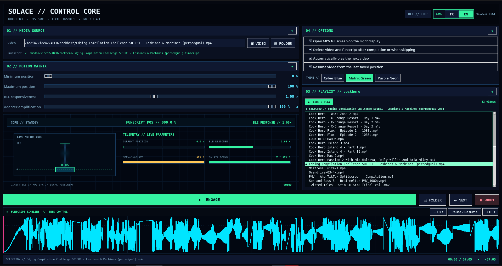

# Solace Pro Funscript Player

Linux video and Funscript player for the Lovense Solace Pro with direct Bluetooth Low Energy (BLE) control, without Intiface.

## Current release

**v1.2.10 — Control Core UI & Live HUD**



## What's new in v1.2.10

- Redesigned **SOLACE // CONTROL CORE** interface
- New live technical HUD with Funscript position and motion telemetry
- Live Motion Core visualization
- Current position, BLE response, amplification and active-range meters
- Improved playlist with persistent visible selection and current-video indicators
- Direct playlist item selection and playback
- Playlist folder name and video count display
- Collapsible Media Source, Motion Matrix, Playlist and Options sections
- Three selectable interface themes: Cyber Blue, Matrix Green and Purple Neon
- Improved FR / EN language controls
- Persistent last-folder and last-video restoration
- Optional per-video playback resume from the last saved position
- Interactive Funscript timeline with seek controls
- Improved use of screen space for large desktop displays

## Features

- Direct BLE control for Lovense Solace Pro
- No Intiface required
- MPV video playback and synchronization
- Local Funscript loading
- Interactive Funscript timeline
- Click/drag seeking and ±10 second controls
- Adjustable minimum and maximum positions
- Adjustable BLE responsiveness
- Motion amplification control
- Live motion and telemetry HUD
- Folder playlist playback
- Automatic next-video playback
- Optional deletion of completed video and matching Funscript
- Persistent per-video resume positions
- Last folder/video restoration
- French / English interface
- Multiple interface themes
- Futuristic Linux desktop GUI

## Requirements

- Linux
- Python 3
- Bluetooth Low Energy
- MPV
- Lovense Solace Pro

Install the Python dependencies listed in `requirements.txt`.

## Run

```bash
python3 Solace-Pro-Funscript-Player-v1.2.10.py
```

The application uses an included direct-BLE engine and does not require Intiface.

## License

MIT License. See `LICENSE`.
